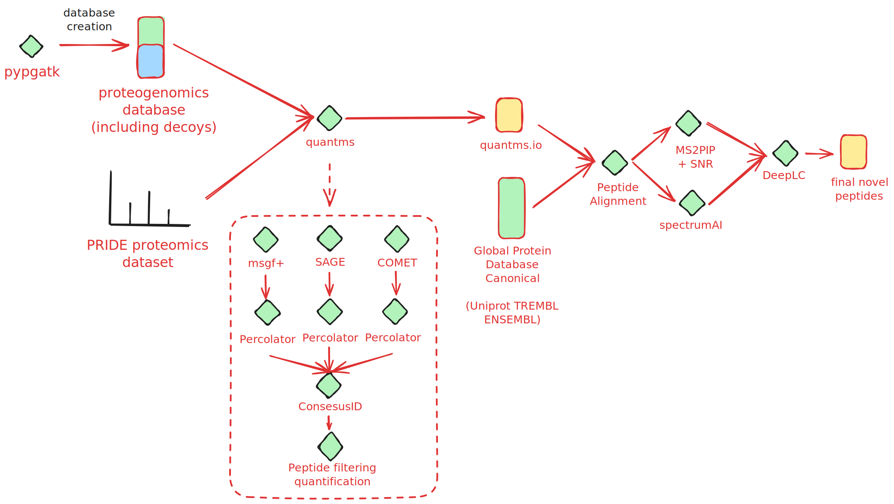

# Pangenome Proteogenomics

Protegenomics analysis based on Pangenome references

The aim of this project is to search normal tissue proteomics datasets to identify novel proteins using the latest genome assemblies published via the [PanGenome project](https://www.nature.com/articles/s41586-023-05896-x).

## Project Aims
- Develop a workflow based on [quantms](https://github.com/bigbio/quantms) to reanalyze public proteomics datasets with custom proteogenomics databases.  
- Develop a workflow that enables systematic validation of novel (non-canonical peptides) using multiple existing tools.

- Performing a comprehensive analysis of multiple `normal` tissue datasets from public domain using databases generated from the latest Pangenome assemblies.
  - Compare scores and FDR for known canonical and novel canonical peptides, check distributions, etc.
  - Revisit FDR calculations and significant measures for non-canonical peptides.
  - Analyze the novel canonical, locations, gene types, other evidence for expression, etc.

- Provide a fasta database with all the novel proteins observed. 
- Draft manuscript layout and sections.

## Proteogenomics workflow

Workflow components: 
- **Database generation**: The proteogenomics database is created with [pypgatk](https://github.com/bigbio/py-pgatk). 
- **quanmts peptide identification**: The proteomics data is searched against the database using [quantms](https://github.com/bigbio/quantms). The workflow uses three search engines including COMET, SAGE and MSGF+ to perform the peptide identification. Percolator is then used to boost the number of peptide identifications and proteomicsLFQ or proteinQuantifier tools are used to perform the quantification and statistical filter of peptides based on the TDA (Target-Decoy approach). 
- **Post-processing**: The identified peptides are then post-processed to identify novel peptides and perform a comprehensive analysis of the results.
  - **Peptide Alignment**: The identified peptides are aligned to a Global canonical protein sequences which includes (ENSEMBL, Uniprot TrEMBL) to identify novel peptides.
  - **Spectrum Validation**: Spectrum identification validation is based on [**MS2PIP**](https://github.com/compomics/ms2pip) and Signal-to-Noise ratio (**SNR**).
  - **Variant annotation**: The identified peptides that contain Single Aminoacid variants (SAAVs) are validated using [spectrumAI tool](https://github.com/bigbio/py-pgatk)
  - **Retention time prediction**: The retention time of the identified peptides is predicted using [DeepLC](https://github.com/compomics/DeepLC)
- **Manual inspection of results using USIs** and [PRIDE USI Viewer](https://www.ebi.ac.uk/pride/archive/usi/)

### Spectrum identification validation

For the spectrum identification, the following python script is used - [ms2pip_novel.py](ms2pip_novel.py). 

`ms2pip_novel.py` contains a series of functions that together help create an MGF file from peptide data, run MS2PIP predictions, and compute additional metrics for each spectrum such as signal-to-noise ratio, number of peaks, and difference between the highest and lowest peaks.

Here's a brief overview of the main components of the code:

- `create_mgf`: The command function that creates an MGF file from a peptide file and MGF file. It reads mzML files (either locally or from an FTP server) and uses the read_spectra_from_mzml function to parse spectra. The function then writes the spectra to an MGF file.
- `run_ms2pip`: The command function that runs MS2PIP predictions on a given peptide and MGF file. It merges predictions with the original data and saves the results to an output file.
- `filter-ms2pip`: The command function that runs the MS2PIP filtering process to remove **low-quality** peptides based on certain thresholds. It filters peptides with a sequence length below a specified threshold and then dynamically sets thresholds based on percentiles for a signal-to-noise ratio.

These functions and command-line commands together facilitate the process of working with peptide and MGF data files, running predictions using MS2PIP, and filtering and computing metrics for the resulting spectra.

### Variant annotation

The spectrumAI algorithm was originally published in Nature Communication by [Yafeng et al.](https://www.nature.com/articles/s41467-018-03311-y) and it was implemented originally in [R](https://github.com/yafeng/SpectrumAI). We implemented the algorithm in [Python in the toolbox pypgatk](https://github.com/bigbio/py-pgatk) enabling faster running of the algorithm and also integration in other Python workflows. The explanation of the [original algorithm](https://github.com/yafeng/SpectrumAI): 

> Assume a 12-amino-acid peptide is identified with single substitution at 8th residue, in order to pass SpectrumAI, it must have matched MS2 peaks (within fragment ion mass tolerance) from at least one of the following groups: b7&b8, y4&y5, y4&b7 or y5&b8. Second, the sum intensity of the supporting flanking MS2 ions must be larger than the median intensity of all fragmentation ions. An exception to these criteria is made when the substituted amino acid has a proline residue to its N-terminal side. Because CID/HCD fragmentation at the C-terminal side of a proline residue is thermodynamically unfavored, SpectrumAI only demands the presence of any b or y fragment ions containing substituted amino acids, in this case, b8 to b11, y5 to y11.

### Retention time prediction

Using DeepLC, the script `deeplc_novel.py` is designed to evaluate the performance of DeepLC on the novel peptides. It uses canonical peptides (e.g. GRCh38 peptides) for training DeepLC and novel peptides peptides to evaluate its performance and filter them. 

- **DeepLC Training and Prediction**: For each sample ID, the script trains a DeepLC model on canonical peptide data. It then uses this trained model to predict retention times (preds_tr) for the novel peptides in the GCA dataset. 
- **Error Calculation and Percentiles**: The script calculates error (the difference between actual and predicted retention times) and absolute error. It also calculates error percentiles, which measure how the errors of the novel peptides compare to the canonical peptides.

## Pangenome reanalysis of normal tissue datasets

### Datasets of normal tissues

We used two big normal tissue datasets to detect novel peptides from pangenomes and to validate the results. The datasets are:

- [PXD010154](https://www.ebi.ac.uk/pride/archive/projects/PXD010154) by [Wang et al.](https://www.embopress.org/doi/full/10.15252/msb.20188503) that is used as a reference to search the databases can be obtained from this associated [SDRF file](PXD010154/PXD010154.sdrf.tsv).
- [PXD016999](https://www.ebi.ac.uk/pride/archive/projects/PXD016999) by [Jiang et al.](https://www.sciencedirect.com/science/article/pii/S0092867420310783?via%3Dihub) that is used to validate the results. Different to PXD010154, this dataset is divided in two different SDRFs [PXD016999-first-instrument.sdrf.tsv](PXD016999/PXD016999-first-instrument.sdrf.tsv), [PXD016999-second-instrument.sdrf.tsv](PXD016999/PXD016999-second-instrument.sdrf.tsv).

### Database information

- [`py-pgatk`](https://github.com/bigbio/py-pgatk) package is used to generate protein sequences for [samples](https://ftp.ensembl.org//pub/rapid-release/species/Homo_sapiens/) provided by [Liao et al.](https://www.nature.com/articles/s41586-023-05896-x) in the [Human Pangenome Reference Consortium](https://humanpangenome.org/). The steps and detailed infromation about the database generation can be accessed through the [db_generation notebook](https://github.com/bigbio/pgt-pangenome/blob/main/db_generation.ipynb).
- Additionally, [`cdna`](https://ftp.ensembl.org/pub/release-110/fasta/homo_sapiens/cdna/Homo_sapiens.GRCh38.cdna.all.fa.gz) and [`ncrna`](https://ftp.ensembl.org/pub/release-110/fasta/homo_sapiens/ncrna/Homo_sapiens.GRCh38.ncrna.fa.gz) files from ENSEMBL release-110 were included in the database.

### Results from analysis

The original PSMs are stored in [quantms.io format](https://github.com/bigbio/quantms.io). 

- PXD010154 PSMs parquet from quantms.io: [PXD010154-pangenome-canonical-0.01.parquet](http://ftp.pride.ebi.ac.uk/pub/databases/pride/resources/proteomes/proteogenomics/noncanonical-tissues-2023/PXD010154-pangenome-canonical-0.01.parquet)
- PXD016999 PSMs parquet from quantms.io: 
  - [PXD016999-first-instrument-8b005cd8-d641-4d1e-a085-c92ed045b4da.psm.parquet](https://ftp.pride.ebi.ac.uk/pub/databases/pride/resources/proteomes/proteogenomics/noncanonical-tissues-2023/PXD016999-first-instrument-8b005cd8-d641-4d1e-a085-c92ed045b4da.psm.parquet)
  - [PXD016999-second-instrument-2739df94-8ceb-4033-a8d3-91adba121f3f.psm.parquet](https://ftp.pride.ebi.ac.uk/pub/databases/pride/resources/proteomes/proteogenomics/noncanonical-tissues-2023/PXD016999-second-instrument-2739df94-8ceb-4033-a8d3-91adba121f3f.psm.parquet)

## Structure of the repository

- [deeplc_novel.py](deeplc_novel.py) For each sample, the Grch38 peptide of that sample was used to calibrate the model to. 
- [ms2pip_novel.py](ms2pip_novel.py) The script is used to validate the identified peptides using MS2PIP and
- [gca_canonical_validation.ipynb](https://github.com/bigbio/pgt-pangenome/blob/main/gca_canonical_validation.ipynb) The GCA peptide in the results was compared with canonical protein to prevent misjudgment and modified to the input format supported by deeplc

### Other notebooks and files generated during the analysis  
- [blast_with_canonical.ipynb](https://github.com/bigbio/pgt-pangenome/blob/main/blast_with_canonical.ipynb) Obtaining variant information with canonical protein by blast
- [Count.ipynb](https://github.com/bigbio/pgt-pangenome/blob/main/Count.ipynb) Statistics on novel peptide information
- [db_generation.ipynb](https://github.com/bigbio/pgt-pangenome/blob/main/db_generation.ipynb) Detailed operations to generate the project database
Signal-to-Noise ratio.
 - [plots](https://github.com/bigbio/pgt-pangenome/tree/main/plots) Figures from the paper can be accessed here
#### tables
- [tables](https://github.com/bigbio/pgt-pangenome/blob/main/tables) The tables in the paper can be accessed here
#### notebooks and scripts
predict the GCA peptide
- [gca_peptides_for_deeplc.ipynb](https://github.com/bigbio/pgt-pangenome/blob/main/gca_peptides_for_deeplc.ipynb) Use deeplc to predict GCA peptides and see the effect of deeplc
- [get_observations.ipynb](https://github.com/bigbio/pgt-pangenome/blob/main/get_observations.ipynb) Obtains observation numbers for peptides
- [get_tissue_distribution.ipynb](https://github.com/bigbio/pgt-pangenome/blob/main/get_tissue_distribution.ipynb) Obtains the distribution of initial and final result peptides in each tissue

## Authors

- [Dong Wang](https://github.com/DongdongdongW) - Chongqing Key Laboratory of Big Data for Bio Intelligence, Chongqing University of Posts and Telecommunications, Chongqing 400065, China.
- [Husen M. Umer](https://github.com/husensofteng) - Bioscience Core Laboratory, King Abdullah University of Science and Technology (KAUST), Thuwal, 23955-6900, Saudi Arabia.
- [Yasset Perez-Riverol](https://github.com/ypriverol) - PRIDE Team, European Bioinformatics Institute (EMBL-EBI), Wellcome Genome Campus, Hinxton, Cambridge, CB10 1SD, UK.

